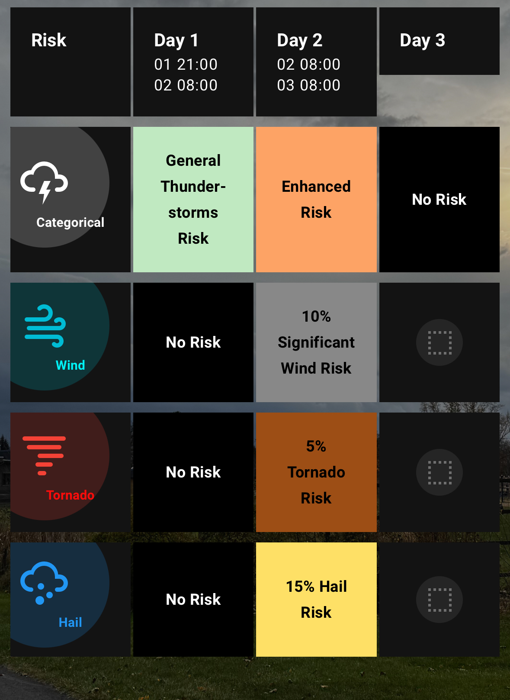
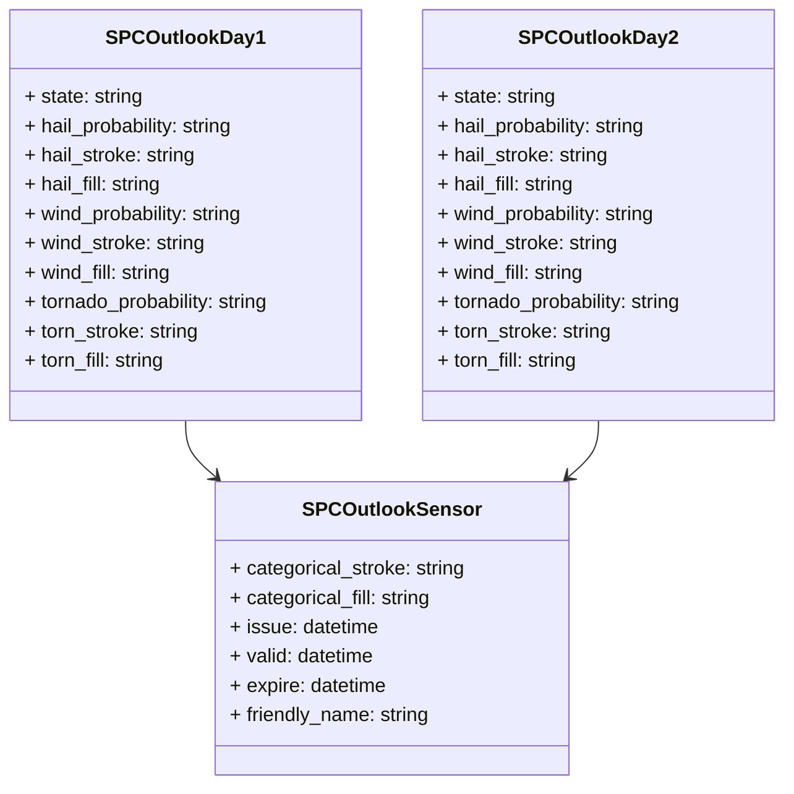

# ⛈️ NWS Storm Prediction Center Outlook for Home Assistant

[](https://github.com/hacs/integration)


[](https://buymeacoffee.com/sedward5)

![downloads][downloads-badge]

A Home Assistant integration to poll weather outlook information from the NWS Storm Prediction Center.

## 🔮 Sensors and Attributes

This integration creates sensors for SPC Outlook Days 1 through 8.

- **sensor.spc_outlook_day_1** to **sensor.spc_outlook_day_8**: Each sensor represents the categorical risk for the respective day.

### ⛈️ Attributes for All Days (1–8)

- `categorical_stroke`: Hex color code for the stroke surrounding your polygon (default: `#FFFFFF`)
- `categorical_fill`: Hex color code for the fill color of the polygon covering your area (default: `#000000`)
- `issue`: Date and time UTC for the issuance of this outlook day (`YYYYMMDDHHMM`)
- `valid`: Date and time UTC for the start of this outlook day (`YYYYMMDDHHMM`)
- `expire`: Date and time UTC for the expiration of this outlook day (`YYYYMMDDHHMM`)
- `friendly_name`: SPC Outlook Day X

### 🌪️ Additional Attributes for Days 1 and 2

- `hail_probability`: (No|X% [Significant ]Hail) Risk
- `hail_stroke`: Hex color code for the stroke surrounding your hail polygon (default: `#FFFFFF`)
- `hail_fill`: Hex color code for the fill color of the hail polygon covering your area (default: `#000000`)
- `wind_probability`: (No|X% [Significant ]Wind) Risk
- `wind_stroke`: Hex color code for the stroke surrounding your wind polygon (default: `#FFFFFF`)
- `wind_fill`: Hex color code for the fill color of the wind polygon covering your area (default: `#000000`)
- `tornado_probability`: (No|X% [Significant ]Tornado) Risk
- `torn_stroke`: Hex color code for the stroke surrounding your tornado polygon (default: `#FFFFFF`)
- `torn_fill`: Hex color code for the fill color of the tornado polygon covering your area (default: `#000000`)

For Days 3–8, the specific risk types (hail, wind, tornado) are not provided and will default to "No Risk".

## 📁 File Structure

```none
custom_components/nws_spc_outlook/
├── __init__.py             # Handles setup and integration lifecycle
├── config_flow.py          # Allows for UI-based setup (latitude/longitude input)
├── coordinator.py          # Handles data fetching and updates
├── sensor.py               # Defines sensor entities and data presentation
├── api.py                  # Handles API requests and processing
├── const.py                # Stores constants like URLs
├── manifest.json           # Defines integration metadata
```

## 🖱️ UI Example

This is a possible layout utilizing these sensors. This requires [mushroom](https://github.com/piitaya/lovelace-mushroom) and [card_mod](https://github.com/thomasloven/lovelace-card-mod) from HACS.



See the code [here](outlook_grid.md).

## 💻 Contributing

I'll be the first to admit I'm no developer. Feel free to submit issues and pull requests to improve this integration. See the [API guide](https://sedward5.github.io/nws_spc_outlook/nws_spc_outlook.html) to get started.


