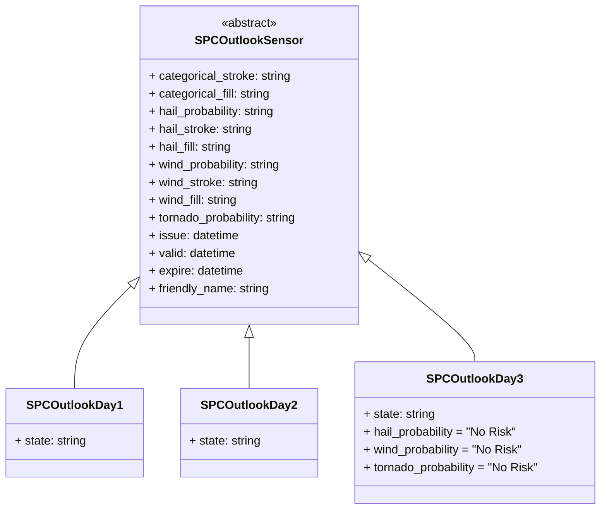
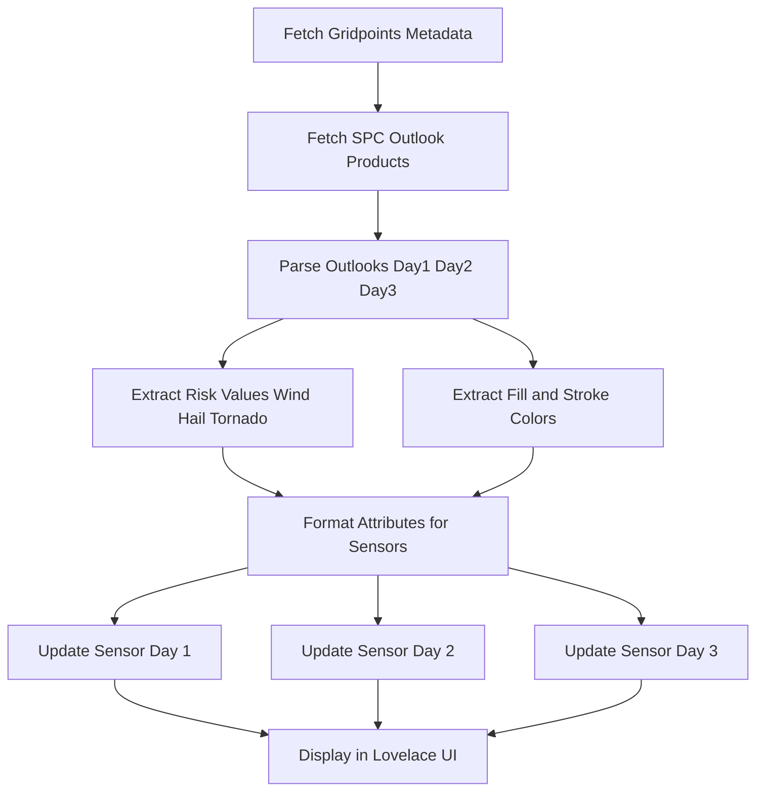

# ⛈️ NWS Storm Prediction Center Outlook for Home Assistant

[](https://github.com/hacs/integration)


[](https://buymeacoffee.com/sedward5)

---
Trying other badge options

[![hacs][hacs-badge]][hacs-url]
[![release][release-badge]][release-url]
![downloads][downloads-badge]
![build][build-badge]

A home assistant integration to poll weather outlook information from the NWS Storm Prediction Center

## 🔮 Sensors and Attributes

```None
sensor.spc_outlook_day_1   # (No|General Thunderstorm|Marginal|Slight|Enhanced|Moderate) Risk
│── categorical_stroke:    # Hex color code for the stroke surrounding your polygon (or #FFFFFF)
│── categorical_fill:      # Hex color code for the fill color of the polygon covering your area or (#000000)
│── hail_probability:      # (No|X% [Significant ]Hail) Risk
│── hail_stroke:           # Hex color code for the stroke surrounding your hail polygon (or #FFFFFF)
│── hail_fill:             # Hex color code for the fill color of the hail polygon covering your area or (#000000)
│── wind_probability:      # (No|X% [Significant ]Wind) Risk
│── wind_stroke:           # Hex color code for the stroke surrounding your wind polygon (or #FFFFFF)
│── wind_fill:             # Hex color code for the fill color of the wind polygon covering your area or (#000000)
│── tornado_probability:   # (No|X% [Significant ]Tornado) Risk
│── issue:                 # Date and time UTC for the issuance of this outlook day (YYYYMMDDHHMM)
│── valid:                 # Date and time UTC for the start of this outlook day (YYYYMMDDHHMM)
│── expire:                # Date and time UTC for the expiration of this outlook day (YYYYMMDDHHMM)
│── friendly_name:         # SPC Outlook Day 1
sensor.spc_outlook_day_2   # (No|General Thunderstorm|Marginal|Slight|Enhanced|Moderate) Risk
│── categorical_stroke:    # Hex color code for the stroke surrounding your polygon (or #FFFFFF)
│── categorical_fill:      # Hex color code for the fill color of the polygon covering your area or (#000000)
│── hail_probability:      # (No|X% [Significant ]Hail) Risk
│── hail_stroke:           # Hex color code for the stroke surrounding your hail polygon (or #FFFFFF)
│── hail_fill:             # Hex color code for the fill color of the hail polygon covering your area or (#000000)
│── wind_probability:      # (No|X% [Significant ]Wind) Risk
│── wind_stroke:           # Hex color code for the stroke surrounding your wind polygon (or #FFFFFF)
│── wind_fill:             # Hex color code for the fill color of the wind polygon covering your area or (#000000)
│── tornado_probability:   # (No|X% [Significant ]Tornado) Risk
│── issue:                 # Date and time UTC for the issuance of this outlook day (YYYYMMDDHHMM)
│── valid:                 # Date and time UTC for the start of this outlook day (YYYYMMDDHHMM)
│── expire:                # Date and time UTC for the expiration of this outlook day (YYYYMMDDHHMM)
│── friendly_name:        # SPC Outlook Day 2
sensor.spc_outlook_day_3  # (No|General Thunderstorm|Marginal|Slight|Enhanced|Moderate) Risk
│── categorical_stroke:    # Hex color code for the stroke surrounding your polygon (or #FFFFFF)
│── categorical_fill:      # Hex color code for the fill color of the polygon covering your area or (#000000)
│── hail_probability:     # No Risk -- not available
│── wind_probability:     # No Risk -- not available 
│── tornado_probability:  # No Risk -- not available
│── issue:                 # Date and time UTC for the issuance of this outlook day (YYYYMMDDHHMM)
│── valid:                 # Date and time UTC for the start of this outlook day (YYYYMMDDHHMM)
│── expire:                # Date and time UTC for the expiration of this outlook day (YYYYMMDDHHMM)
│── friendly_name:        # SPC Outlook Day 3
```

## 📁 File structure

```None
custom_components/nws_spc_outlook/
│── __init__.py          # Handles setup and integration lifecycle
│── config_flow.py        # Allows for UI based setup (lat/lon input)
│── coordinator.py       # Handles data fetching and updates
│── sensor.py             # Defines sensor entities and data presentation
│── api.py                # Handles API requests and processing
│── const.py              # Stores constants like URLs
│── manifest.json         # Defines integration metadata
```

## 🖱️ UI Example

This is a possible layout utilizing these sensors. This requires [mushroom](https://github.com/piitaya/lovelace-mushroom) and [card_mod](https://github.com/thomasloven/lovelace-card-mod) from HACS.


See the code [here](outlook_grid.md)

## 💻 Contributing

I'll be the first to admit I'm no developer. Feel free to submit issues and pull requests to improve this integration. See the [api guide](https://sedward5.github.io/nws_spc_outlook/nws_spc_outlook.html) to get started.





## ⚖️ Disclamer

This project and its author are in no way affialted with the National Weather Service. This addon should not be used as your sole source of information for severe weather preparedness. Stay informed, have a plan, be prepared.
